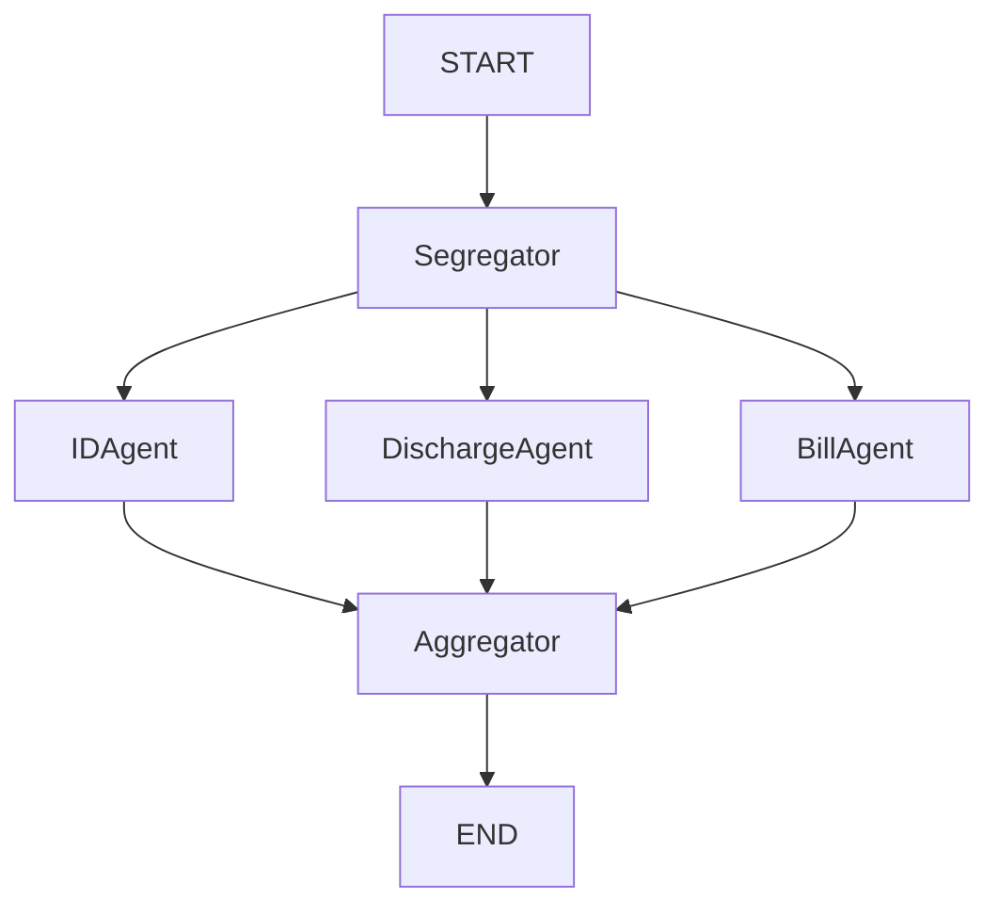

# Claim Processing Pipeline

An AI-powered insurance claim document extraction system built with **FastAPI**, **LangGraph**, and **Google Gemini (GenAI)**. This pipeline automatically segregates PDF pages and extracts structured data from identity documents, discharge summaries, and hospital bills.

## 🚀 Overview

The pipeline uses a multi-agent architectural pattern to process complex medical claim documents:
1.  **PDF Conversion**: Converts PDF pages into images for visual processing.
2.  **Document Segregation**: Classifies each page into types (e.g., Claim Form, ID, Bill, Discharge Summary).
3.  **Specialized Extraction**:
    -   **ID Agent**: Extracts patient details and policy info.
    -   **Discharge Agent**: Extracts admission dates, diagnoses, and procedures.
    -   **Bill Agent**: Extracts itemized costs, taxes, and totals.
4.  **Aggregation**: Consolidates all extracted data into a single, structured JSON response.

## 🛠 Project Structure

```text
claim-processing/
├── main.py             # FastAPI API implementation
├── workflow.py         # LangGraph pipeline and agent logic
├── pdf_utils.py        # PDF-to-Image processing utilities
├── test_pipeline.py    # CLI script for testing the workflow
├── .env                # API Key configuration
├── requirements.txt    # Project dependencies
└── final_image_protected.pdf  # Sample document
```

## 🏗 Setup & Installation

This project uses `uv` for lightning-fast dependency management and virtual environments.

1.  **Clone the Repository**
    ```bash
    git clone https://github.com/adityakanamadi281/claim-processing-pipeline.git
    cd claim-processing
    ```

2.  **Create Virtual Environment**
    ```bash
    uv venv
    . .venv/bin/activate  # On Windows: .venv\Scripts\activate
    ```

3.  **Install Dependencies**
    ```bash
    uv pip install -r requirements.txt
    ```

4.  **Configure Environment Variables**
    Create a `.env` file in the root directory and add your Gemini API Key:
    ```text
    GEMINI_API_KEY="your_api_key_here"
    ```

## 🏃 Running the Project

### Start the API Server
```bash
uv run python main.py
```
The server will start at `http://127.0.0.1:8000`. You can access the Interactive API docs at `http://127.0.0.1:8000/docs`.

### API Endpoints
-   `GET /health`: Check if the service is running.
-   `POST /api/process`: Upload a PDF to process a claim.
    -   **Form Data**: `claim_id` (string)
    -   **File**: `file` (PDF)

### Run CLI Test
```bash
uv run python test_pipeline.py
```
*(Note: Ensure the PDF path in `test_pipeline.py` is updated to a valid file on your system)*

## 🧠 Workflow Details

The system uses a **LangGraph** state machine:

-   **Segregator Node**: Uses Gemini to identify the type of each page.
-   **Agent Nodes**: Run in parallel (ID, Discharge, Bill) depending on the documents found.
-   **Aggregator Node**: Collects results from all active branches.



## 📄 License
MIT
